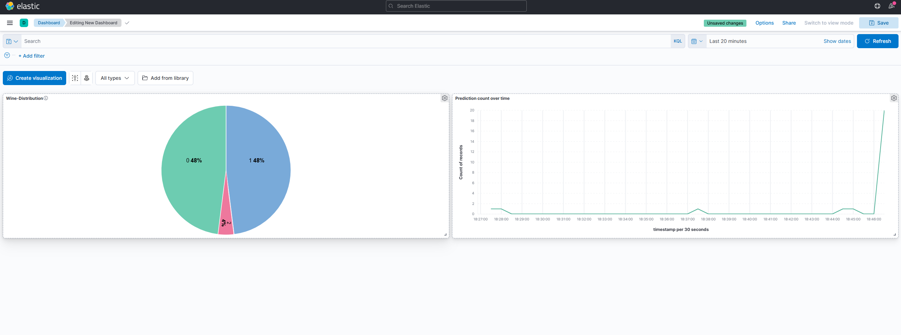

# ELK Wine Prediction Monitoring Lab

A wine prediction API with Elasticsearch, Logstash, and Kibana (ELK) for logging and visualizing predictions in real-time.

## Folder Structure

```bash
elk-lab/
├── docker-compose.yml          # ELK stack configuration
├── src/
│   ├── train_model.py      # Train and save wine model
│   ├── app.py              # FastAPI prediction endpoint
│── test
│    ├── test_predictions.py    # Generate test predictions
│
└── model/
    ├── wine_model.pkl
    ├── feature_names.pkl
    └── target_names.pkl
```

## How to Run

### 1. Start ELK Stack

```bash
cd ELK_lab05
docker-compose up -d
```

Wait 1-2 minutes for services to start.

### 2. Train the Model

```bash
cd wine-prediction-api
python src/train_model.py
```

### 3. Start the FastAPI Server

```bash
uvicorn src.app:app --reload
```

### 4. Generate Predictions

Open a new terminal:

```bash
python src/test_predictions.py
```

This sends 20 predictions to the API, which are logged to Elasticsearch.

### 5. View Dashboard in Kibana

1. Open browser: `http://localhost:5601`
2. Go to **Stack Management** → **Index Patterns** → Create pattern `wine-predictions*`
3. Go to **Visualize Library** → Create visualizations (Pie chart, Line chart, etc.)
4. Go to **Dashboard** → Add your visualizations
5. Refresh to see updated predictions!

## Screenshots


